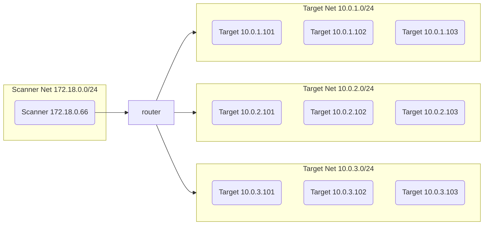

# About speed and reliability

Nmap supports, lets say sequential, parallelism too. Therefore it's fair enough to ask, how much faster nparallel is. Furthermore it is of interest, if there are any downsides of nparallel's approach regarding reliability (e.g. do slow responsive hosts or ports get discoverd).

## TL;DR
The lab environment shows that nparallel operates in nearly all situations faster than nmap. In the lab environment it was between 2-6x as fast as nmap. The result quality, in terms of detected ports, stays the same. 

The effectivness of nparallel increases in situations with ..
* slow router/host response time (nearly 6x faster on 100ms delay)
* many subnets (3 times faster on 15 subnets)
* many hosts (3-4 times faster with 64 hosts)

The minimum number of threads used by nparallel should be equal to the amount of cores the system offers. Less threads lead to a slower performance. More threads doesn't increase the performance but can be better, because sometimes hosts become unresponsive and block single threads.


## Context
Lets just recap what the core difference of nparallel and nmap is: 

Nmap takes a list of hosts and fits them into *hostgroups*  (see the [official nmap documentation on this](https://nmap.org/book/man-performance.html)). The size of an hostgroup is bounded by the flags ```--min-hostgroup``` and ```--max-hostgroup```. Each hostgroup is then scanned. All hosts in a hostgroup get actually scanned in parallel. The parallelism is bounded by the parameters ```--min-parallelism``` and ```--max-parallelism```. 
However, because of this sequential parallelism, nmap has to wait until a hostgroup is finished, before continuing with the next one. While scanning real networks this often results in long running scans.
If you are asking yourself "Why not set ```--min-hostgroup``` to the total number of hosts, so all hosts get scanned in parallel?" - that would come with a big drawback! Since nmap only saves its results after it finished a complete hostgroup, it would mean that all results are lost, if you pause or cancel your scan before.

In contrast nparallel takes a list of hosts and splits them into single ones. Every host is scanned using an ordinary nmap command, just that these commands run in real parallel threads. The number of threads can be set with the ```--thread``` flag. Given the case that a host takes longer to complete, nparallel just keeps it running and continues with the remaining ones. Each finished nmap thread writes its results in a seperate file. That means a nparallel scan can be interrupted at any time and results from finished hosts will be there.

These are only my theoretical thoughts, about what I've known about nmap so far. I haven't ever looked into the [nmap source code](https://github.com/nmap/nmap) by myself and checked, if my "total parallel approach" would break any of nmap's host or port discovery features. Because I'm not good in reading C or C++ I tried to evaluate my assumptions in practice. 

## Test lab 

To check how nparallel performs against nmap regarding speed and reliability, I've wrote a small script (see [generate-lab.py](./generate-lab.py)) which creates a network lab environment using docker.

The lab simulates an environment with different subnets and hosts. It is also able to simulate real-life parameters like bandwidth and response delay. This is done by a virtual router which connects a ```Scanner Net``` with different ```Target Net```. The router can artificially be corrupted by adjusting its bandwith, delay or package loss probability. All hosts in the target networks have only the TCP port 80 open.

The overall lab network looks like the following:



If you wish to build your own lab, see the [lab documentation](./LAB.md).

## Tests

The advantage of having a lab environment is that the impact if differant variables can be measured individually. I have written a few test cases to measure the performance impact of different network or scan config changes. 

The following table lists the **Test Cases**. The raw data can be found following the links in the **Result Data** row.

To check if the scan performance differ if only existing host get scanned or whole network ranges, each test case had been run in both ways (see **Hosts** or **Netrange** links). 

To evaluate the scan **Speed**, it had been measured how long it takes for a tool to scan all targets. The determine the result **Realiability** it had been checked, if all open ports had been found.

Test Case | Result Data | Speed Evaluation | Reliability  Evaluation
--|--|--|--
Increasing router delay | [Hosts](test-01.increase-delay.sh.results.md)/[Netrange](test-02.increase-delay-netrange.sh.results.md) | With growing router delay the **speed advantage of nparallel** increases. | even
Increasing router latency | [Hosts](test-03.increase-latency.sh.results.md)/[Netrange](test-04.increase-latency-netrange.sh.results.md) | The latency doesn't influence the test speed. | (nearly) even
Increasing amount of subnets | [Hosts](test-05.increase-subnet.sh.results.md)/[Netrange](test-06.increase-subnet-netrange.sh.results.md) | With growing amount of subnets the **speed advantage of nparallel** increases. | (nearly) even
Increasing amount of hosts | [Hosts](test-07.increase-hosts.sh.results.md)/[Netrange](test-08.increase-hosts-netrange.sh.results.md) | With growing amount of hosts the **speed advantage of nparallel** increases. | even
Increasing scanner parallelism  | [Hosts](test-09.increase-parallelism.sh.results.md)/[Netrange](test-10.increase-parallelism-netrange.sh.results.md) | The test was performed on a system with 16 cores. Running nparallel with less threads than cores leads to a slower scan performance. Running it with more than 16 cores doesn't let to a better one. Hower running it with threads double the amount of cores can be good, if some threads hang, e.g. due to inresponsive hosts. | (nearly) even


